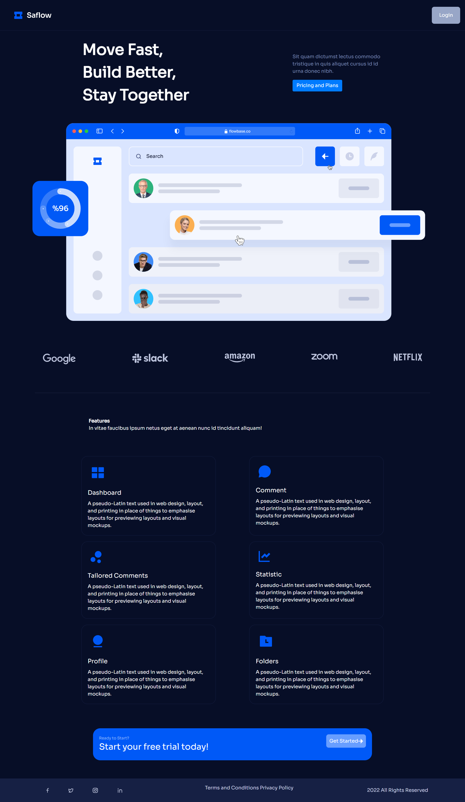
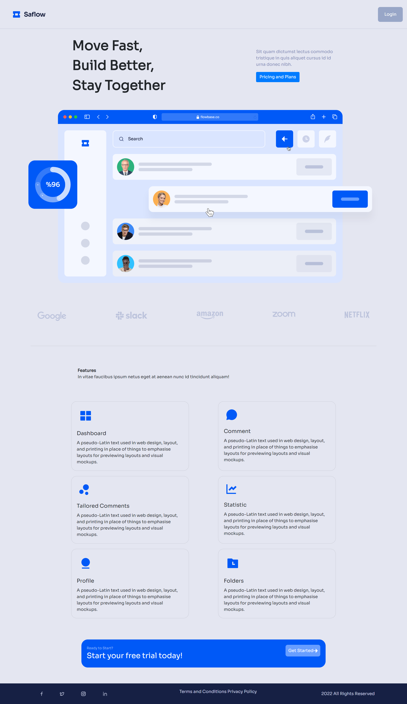
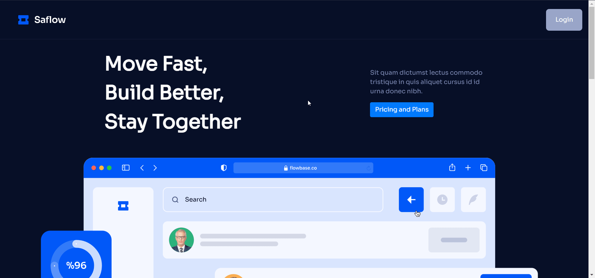
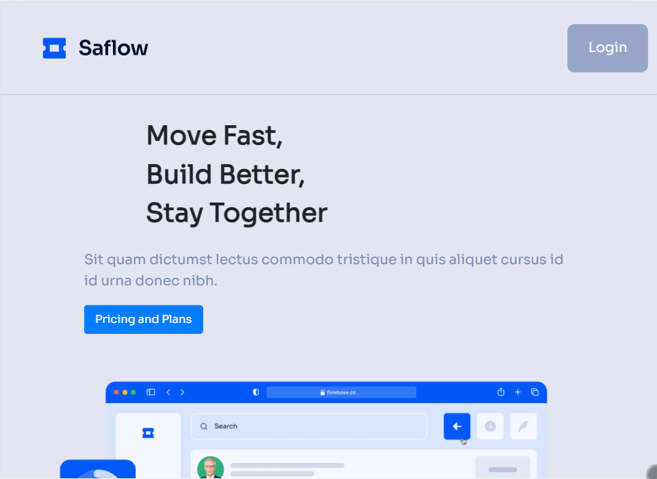
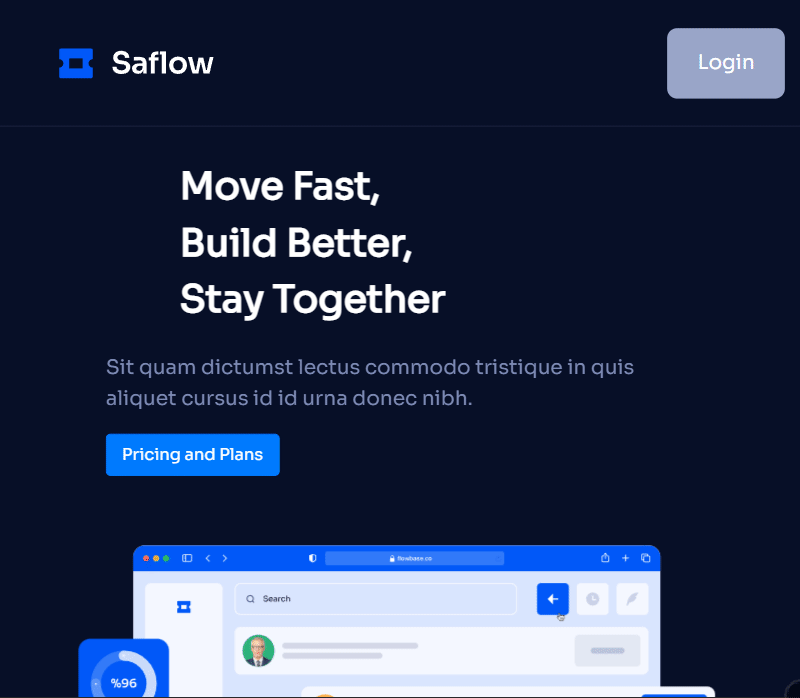

# Satflow

Task 1 - Front End Development

A responsive webpage along with Dark and Light Mode which change with Systemwide changes in the respective modes.

If you want to activate dark mode, change your system theme to dark mode, similarly for light mode change your system theme to light mode.

***
## Screenshots of the entire Webpage

   

# Built With

- Bootstrap
- Animate on Scroll (AOS)

# Responsive Design

## Desktop - 1024px

## Tablet - 768px

## Mobile - 640px

